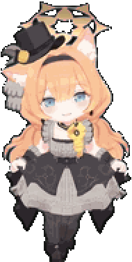
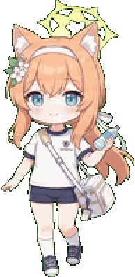

# codex-pet-collection

A growing collection of hand-crafted animated desktop pets for [Codex CLI](https://codex-pet.org) and [CC-Haha](https://github.com/) — currently featuring **Mari (Idol Ver.)** and **Mari (Gym Ver.)** from *Blue Archive*, rendered as 9-state sprite animations.

> [!TIP]
> **Jump to:** [Pets](#-pets) · [Install](#-install) · [Formats](#-file-formats) · [Credits](#-credits) · [中文说明](README.zh-CN.md)

---

## 🐾 Pets

### Mari — Idol Ver. (`mari-idol`)

> "Actually… I've always dreamed of becoming an idol. — May this song reach you."

Mari of the Sisterhood, Trinity General School, and leader of the idol unit **Antique Seraphim**. She sings so that everyone can be a little happier.

| Idle preview |  |
|---|---|
|  | 9 states · 6×9 grid · 256×208 px per frame |

- **Petdex entry:** [#4306 → mari-2](https://petdex.dev/pets/mari-2)
- **codex-pet.org:** [mari](https://codex-pet.org/pets/mari/)

### Mari — Gym Ver. (`mari-gym`)

> "I hope everyone can get through this great athletic festival with a smile on their face."

Mari in her sports uniform for the Ōarai Kahin Grand Festival — the ever-devoted event committee member who keeps getting tangled up in everyone's trouble.

| Idle preview |  |
|---|---|
|  | 9 states · 6×9 grid · 256×208 px per frame |

- **Petdex entry:** [mari-gym](https://petdex.dev/pets/mari-gym)

---

## 📦 Install

### Via Petdex (recommended)

```bash
npx petdex install mari-2      # Mari — Idol Ver.
npx petdex install mari-gym    # Mari — Gym Ver.
```

Works with **Codex**, the **ChatGPT desktop app**, and **Petdex Desktop**.

### Via codex-pet.org

```bash
npx codex-pet-installer add mari
```

### Manual install

Clone this repo (or download a ZIP) and copy the pet folder you want:

```bash
git clone <repository-url>

# CC-Haha — copy into ~/.claude/cc-haha/pets/
cp -r codex-pet-collection/pets/mari-idol ~/.claude/cc-haha/pets/
cp -r codex-pet-collection/pets/mari-gym ~/.claude/cc-haha/pets/

# Codex CLI / other loaders that follow the codex-pet layout
cp -r codex-pet-collection/pets/mari-idol ~/.codex/pets/   # adjust to your client's pets dir
```

Each pet folder is self-contained: `pet.json` (metadata) + `spritesheet.png` (all frames). Restart your client afterwards.

---

## 🗂 File formats

```
pets/
├── mari-idol/
│   ├── pet.json          # id / display name / description / sprite version
│   ├── spritesheet.png   # 1536×2288 RGBA, 6 columns × 9 rows, 256×208 px per frame
│   └── preview.gif       # looping idle animation (for this README)
└── mari-gym/
    └── …
```

**Animation states** (one row of the spritesheet each, top → bottom):

| # | State | # | State |
|---|---|---|---|
| 1 | Idle | 6 | Failed |
| 2 | Run right | 7 | Waiting |
| 3 | Run left | 8 | Running |
| 4 | Waving | 9 | Review |
| 5 | Jumping | | |

`pet.json` schema:

```jsonc
{
  "id": "mari",                    // unique pet id used by the loader
  "displayName": "偶像玛丽",        // shown in the pet switcher
  "description": "…",              // flavor text
  "spriteVersionNumber": 2,        // spritesheet format version
  "spritesheetPath": "spritesheet.png"
}
```

---

## ✍️ Make your own

1. Build a spritesheet: **6 columns × 9 rows**, each cell **256×208 px**, transparent background — row *n* is state *n* from the table above, frames play left → right.
2. Fill in a `pet.json` (schema above).
3. Drop the folder into your client's pets directory and restart.

---

## 🏷 Tags & search

`blue-archive` · `mari` · `iocchi mari` · `trinity` · `desktop pet` · `codex pet` · `spritesheet` · `pixel art` · `fan art`

## 🙏 Credits

- **Sprites** — made by [Project Contributors](<account-url>)
- **Character** — Mari (伊落マリー / Iochi Mari) from *Blue Archive* © Nexon Games / Yostar. This is unofficial fan art; the character belongs to its rights holders.
- **Petdex** — [petdex.dev](https://petdex.dev) · **codex-pet.org** community

## 📄 License

The code and packaging in this repo are released under the [MIT License](LICENSE).
The sprite artwork is fan art of a copyrighted character: non-commercial use only, and *Blue Archive*'s rights holders retain all rights to the character.
